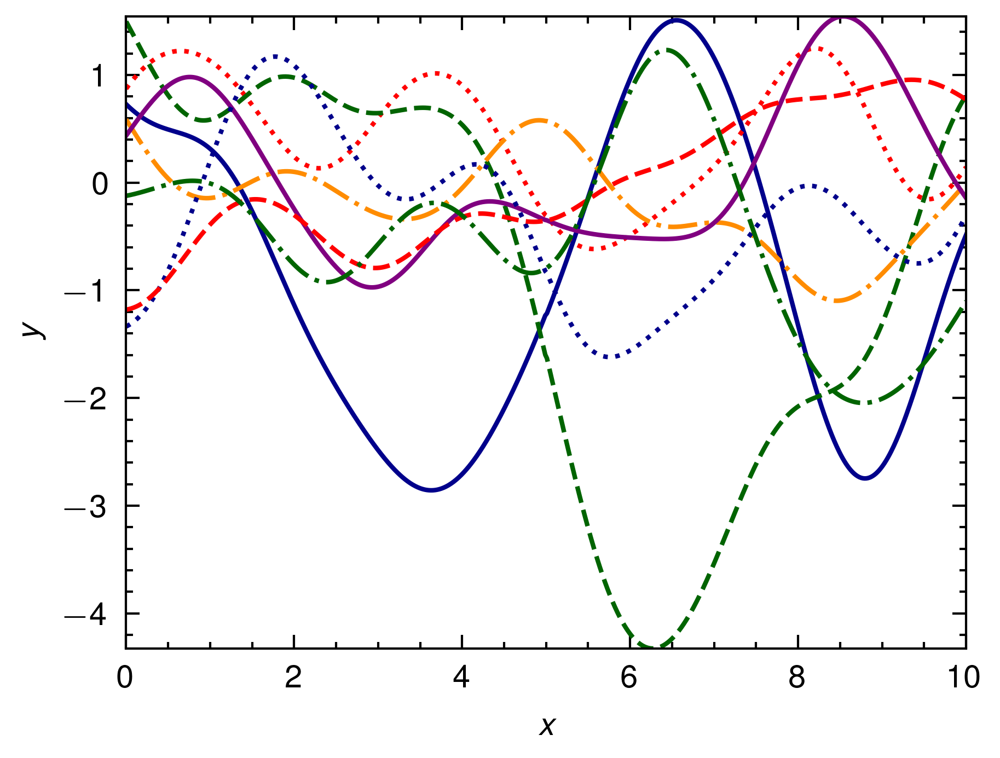

# Rugfield

`rugfield` is a Rust library for generating Gaussian Random Fields (GRF) using the circulant embedding method. It provides a simple and efficient way to generate GRFs for a given range and sigma value.

## Features

- Generate Gaussian Random Fields for a specified range and sigma value
- Implements the circulant embedding method for efficient GRF generation
- Utilizes the `rustfft` library for Fast Fourier Transform (FFT) operations
- Provides a stationary Gaussian kernel function

## Installation

To use `rugfield` in your Rust project, add the following to your `Cargo.toml` file:

```toml
[dependencies]
rugfield = "0.2.0"
```

## Usage

Here's an example of how to use `rugfield` to generate multiple Gaussian Random Fields and plot them: ([`examples/simple.rs`](examples/sqaured_exponential_test))

```rust
use rugfield::gen_grf;
use peroxide::fuga::*;
use std::error::Error;

fn main() -> Result<(), Box<dyn Error>> {
    let x_max = 10.0;
    let x_min = 0.0;
    let sigma = 1.0;
    let n = 1000;
    let samples = 8;

    let x = linspace_with_precision(x_min, x_max, n, 2);

    let grfs = (0..samples)
        .map(|_| gen_grf(x_min, x_max, sigma, n))
        .collect::<Vec<_>>();

    // Plot
    // ... (omit plotting code)
}
```

This example generates multiple Gaussian Random Fields with a range from 0.0 to 10.0, a sigma value of 1.0, and a size of 1000. It then plots the generated GRFs using different line styles and colors. (To run this example, you'll need to use `plot` feature in `peroxide` crate.)

Here's the resulting plot:



## Dependencies

`rugfield` depends on the following libraries:

- `rustfft`: For performing Fast Fourier Transform operations
- `peroxide`: For random number generation and plotting

Make sure to have these dependencies installed in your project.

## Documentation

For more detailed information about the functions and their usage, please refer to the documentation comments in the source code.

## Contributing

Contributions to `rugfield` are welcome! If you find any issues or have suggestions for improvements, please open an issue or submit a pull request on the GitHub repository.

## License

`rugfield` is licensed under the [MIT License](LICENSE).
