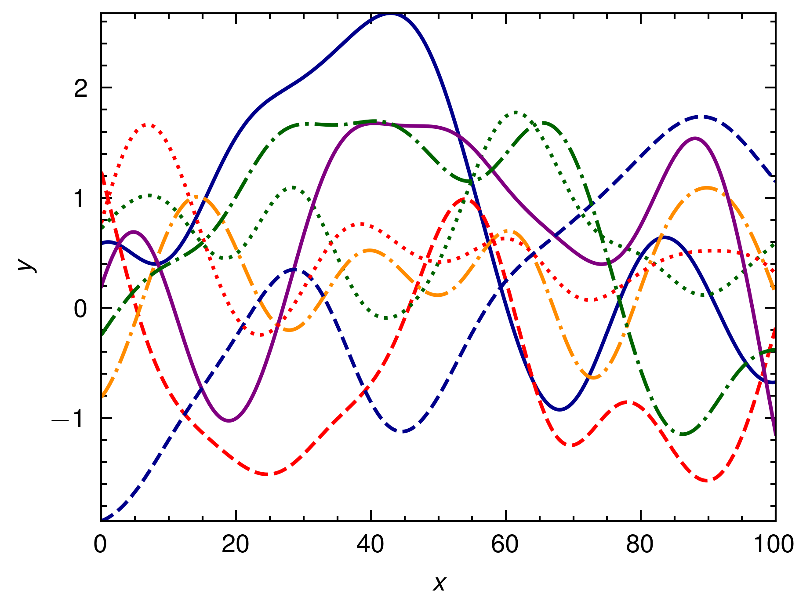

# Rugfield

Rugfield is a Rust library for generating Gaussian Random Fields (GRFs) using the circulant embedding method. It provides an efficient and easy-to-use implementation for simulating GRFs with various kernel functions.

## Features

- Generate GRFs using the circulant embedding method
- Support for various kernels.
  - `SquaredExponential`
  - `Matern`
  - `LocalPeriodic`
  - `RationalQuadratic`
- Efficient computation using the `rustfft` library
- Optional serialization support with the `serde` feature

## Installation

Add the following to your `Cargo.toml` file:

```toml
[dependencies]
rugfield = "0.2.1"
```

## Usage

Here's a simple example of how to use Rugfield to generate a GRF with a squared exponential kernel:

```rust
use rugfield::{grf, Kernel};

fn main() {
    let n = 100;
    let kernel = Kernel::SquaredExponential(0.1);
    let grf_data = grf(n, kernel);

    // Plot the GRF data
    // ...
}
```

This code generates a GRF with a squared exponential kernel and a length scale of 0.1. The resulting GRF data is stored in the `grf_data` vector.

For a complete example, see the `examples/squared_exponential.rs` file:

```rust
use peroxide::fuga::*;
use rugfield::{grf, Kernel::SquaredExponential};

fn main() -> Result<(), Box<dyn Error>> {
    let x_max = 100.0;
    let x_min = 0.0;
    let sigma = 0.1;
    let n = 1000;
    let samples = 8;
    let kernel = SquaredExponential(sigma);
    let x = linspace_with_precision(x_min, x_max, n, 2);
    let grfs = (0..samples).map(|_| grf(n, kernel)).collect::<Vec<_>>();

    // Plot the GRF data
    // ...

    Ok(())
}
```

The above code generates multiple GRFs with a squared exponential kernel and plots the resulting data. Here's an example output:



## Documentation

For detailed documentation and API reference, please refer to the [Rustdoc documentation](https://docs.rs/rugfield).

## License

Rugfield is licensed under the [MIT License](LICENSE).

## Contributing

Contributions are welcome! If you find any issues or have suggestions for improvements, please open an issue or submit a pull request on the [GitHub repository](https://github.com/Axect/rugfield).

## Acknowledgments

Rugfield was inspired by the paper "An Effective Method for Simulating Gaussian Random Fields" by Grace Chan (1999).
We would like to express our gratitude to the authors of the `rustfft` library for their excellent work, which has been instrumental in the development of Rugfield.
